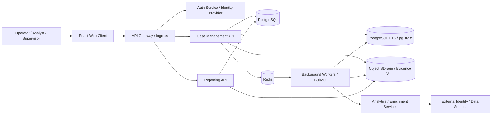

# Production Specification

## 1. Purpose

This document defines the recommended production specification for the SENTINEL Case Management Console after the current Dockerized PostgreSQL MVP is hardened for real deployment. It focuses on the ideal production stack, target architecture, security posture, operational services, and delivery constraints.

This recommendation intentionally aligns with the previously developed NEXUS platform in `/Users/syahrizan.ali/projects/personal/network-analysis`, because the original shared prompt described SENTINEL as using the same theme and broader product style as that earlier identity and link-analysis system.

## 2. Production Goals

1. Support secure multi-user case operations.
2. Persist cases, subjects, evidence, and reports in controlled back-end services.
3. Enforce role-based access control and auditable workflows.
4. Support fast cross-record retrieval and relationship analysis.
5. Preserve stack and architecture continuity with NEXUS where it improves maintainability.

## 3. Recommended Production Stack

| Layer | Recommended Technology | Reason |
| --- | --- | --- |
| Front end | React 18 + TypeScript + Vite | Matches the NEXUS actual-system direction and supports a maintainable typed client |
| Client routing | React Router or TanStack Router | Explicit route and view composition for a growing console |
| Server state | TanStack Query | Caching, retries, invalidation, and API-state management |
| Front-end state | Zustand | Lightweight local workspace state, consistent with the NEXUS direction |
| Graph visualization | Cytoscape.js | Better fit than `d3-force` for a production investigation graph with larger interactive workspaces |
| Backend API | NestJS + TypeScript | Aligns with NEXUS, preserves a single-language TypeScript stack, and fits modular operational APIs |
| Background jobs | NestJS workers + Redis + BullMQ | Handles report generation, indexing, sync, imports, and analytics jobs |
| Database | PostgreSQL | Strong transactional fit for case, subject, evidence, audit metadata, and workflow state |
| Search | PostgreSQL full-text search + `pg_trgm` initially | Matches the NEXUS plan and avoids introducing a separate search cluster too early |
| Optional search scale-up | OpenSearch | Add when data volume or retrieval complexity exceeds PostgreSQL search |
| ORM | Prisma | Type-safe schema management, migrations, and developer ergonomics |
| Cache / queue | Redis + BullMQ | Session support, short-lived cache, and asynchronous workflows |
| Object storage | MinIO or approved S3-compatible storage | Secure storage for evidence files, exports, and large attachments |
| Identity | JWT access token + refresh token initially; enterprise SSO later | Matches NEXUS sequencing while preserving a path to stronger enterprise identity |
| Password security | argon2 hashing | Matches the NEXUS production-grade auth plan |
| Reporting | Server-side Playwright HTML-to-PDF | Controlled report rendering and consistent output, aligned with NEXUS |
| Observability | OpenTelemetry + Prometheus + Grafana + centralized logs | Metrics, traces, alerts, and operational diagnostics |
| Deployment | Docker + Kubernetes | Environment segregation, scaling, orchestration, and controlled rollout |

## 4. Alternative Stack Notes

1. If the team wants continuity with the already-built NEXUS monorepo, NestJS should be the default backend choice.
2. If the organization is strongly Java-based, Spring Boot is the main alternative.
3. If Kubernetes is too heavy for the first production phase, Docker Compose or a smaller managed container platform can be used temporarily, but it should not be the long-term target.
4. If OpenSearch is unavailable later, Elasticsearch is the direct substitute.

## 5. Target Production Architecture

## 6. Core Production Services

### 6.1 Case Management API

Responsibilities:

1. Case CRUD and status transitions.
2. Subject-to-case linking.
3. Evidence metadata registration.
4. Assignment, ownership, and workflow state.
5. Access-controlled record retrieval.

### 6.2 Subject Registry Service

Responsibilities:

1. Subject profile storage.
2. Threat profile persistence.
3. Reverse case linkage.
4. Future de-duplication and merge-review workflows.

### 6.3 Evidence Service

Responsibilities:

1. Evidence metadata management.
2. Secure file/object handling.
3. Chain-of-custody events.
4. Integrity checks and retention support.

### 6.4 Reporting Service

Responsibilities:

1. Case report generation.
2. Subject dossier generation.
3. Server-side PDF/HTML rendering.
4. Access-controlled export history.

### 6.5 Search Service

Responsibilities:

1. Full-text search.
2. Filtered and faceted retrieval.
3. Cross-case and cross-subject discovery.
4. Index refresh on record changes.

### 6.6 Analytics And Integration Services

Responsibilities:

1. External identity or source ingestion.
2. Correlation and enrichment.
3. Context extraction.
4. Future graph and risk-scoring expansion.

## 7. Production Security Specification

1. Authentication must be server-managed, not client-local.
2. MFA must be enforced when enterprise identity is introduced.
3. Authorization must use RBAC with scoped permissions for operator, analyst, supervisor, and administrator roles.
4. Audit logging must be append-only or tamper-evident.
5. Evidence access must be logged at view, download, export, and modification points.
6. Secrets must be stored in a managed secret store, not in application config files.
7. Data in transit must use TLS.
8. Sensitive data at rest must use database and storage encryption.
9. Report generation and export must be access-controlled.
10. The production build must contain no hard-coded credentials or hidden accounts.

## 8. Production Data Stores

### 8.1 PostgreSQL

Recommended for:

1. Cases
2. Subjects
3. Links
4. Evidence metadata
5. Audit metadata
6. Report metadata
7. User-facing workflow state

### 8.2 Object Storage

Recommended for:

1. Evidence files
2. Exported reports
3. Decoded documents
4. Large media or attachments

### 8.3 Search Layer

Recommended progression:

1. PostgreSQL full-text search and `pg_trgm` in the first production phase.
2. OpenSearch only when scale or query complexity justifies a separate search cluster.

## 9. Environment Specification

Minimum environments:

1. Development
2. Test / Integration
3. UAT
4. Production

Each environment should have:

1. Separate configuration and secrets.
2. Separate database instances or isolated schemas as approved.
3. Separate object storage buckets.
4. Separate search indexes when a separate search service exists.
5. Separate monitoring and alert routing.

## 10. Deployment Specification

1. Package services as Docker images.
2. Deploy through Kubernetes with environment-specific manifests or Helm charts.
3. Use rolling deployments for UI and APIs.
4. Run database migrations through a controlled release step.
5. Support horizontal scaling for APIs, workers, and search consumers.
6. Apply ingress rules, network policies, and namespace isolation.

## 11. Operational Specification

1. Centralized logs for UI, API, workers, and security events.
2. Metrics for API latency, error rate, search latency, queue depth, storage growth, and report duration.
3. Alerts for failed jobs, failed logins, high error rates, storage thresholds, and indexing lag.
4. Daily backups for PostgreSQL and versioned object-storage policies.
5. Disaster recovery procedures for database restore, search rebuild, and evidence-store validation.

## 12. Production Readiness Gaps From The Current MVP

The current repository does not yet provide:

1. Real authentication and RBAC.
2. Backend persistence.
3. Immutable or tamper-evident audit logs.
4. Evidence file storage and integrity controls.
5. Search infrastructure beyond client-side filtering.
6. Background jobs and message-driven workflows.
7. Server-side report generation.
8. Environment-specific deployment assets.

## 13. Recommended Delivery Sequence

1. Extract the current front-end state model behind API contracts.
2. Build the Case Management API and PostgreSQL schema.
3. Add JWT auth, refresh sessions, argon2 password hashing, and RBAC.
4. Introduce object storage for evidence and generated reports.
5. Add PostgreSQL search and indexing support.
6. Move report generation to the server.
7. Add analytics and external source integrations.
8. Add enterprise SSO and MFA when required by the deployment environment.
9. Complete hardening, monitoring, backup, and DR validation.

## 14. Preferred Production Baseline

If a single production baseline must be chosen now, use:

1. React + TypeScript + Vite front end.
2. NestJS + TypeScript backend services.
3. PostgreSQL for transactional data and initial search.
4. Prisma for schema management and data access.
5. Cytoscape.js for production graph workspaces.
6. Redis + BullMQ for cache and asynchronous work.
7. MinIO or approved S3-compatible storage for evidence.
8. JWT + refresh tokens first, with enterprise SSO added when required.
9. Playwright for server-side PDF generation.
10. OpenTelemetry, Prometheus, Grafana, and centralized logs for observability.
11. Docker + Kubernetes for deployment.
