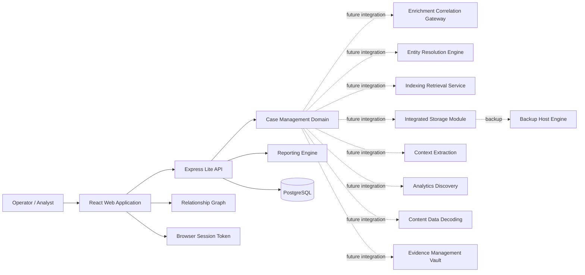

# Solution Architecture

## 1. Architecture Summary

The solution is designed as a modular intelligence platform centered on a case management core. The MVP in this repository implements the user-facing application, an Express API, a Prisma/PostgreSQL repository, and the domain model for a standalone case console, while preserving seams for future service extraction.

## 2. Target Logical Modules

1. Case Management Core
2. Enrichment and Correlation Gateway
3. Entity Resolution and De-duplication Engine
4. Indexing and Retrieval Service
5. Integrated Storage Module
6. Backup Host System Engine
7. Context Extraction Service
8. Analytics Discovery Service
9. Unified Case Repository
10. Operational Dashboard
11. Content and Data Decoding
12. Evidence Management Vault

## 3. MVP Boundary In This Repository

Implemented directly in the web application:

1. Case Management Core
2. Unified Case Repository domain behavior
3. Operational Dashboard
4. Threat profiling and reporting
5. Evidence linkage and local audit history
6. API-backed mutations through the Express service

Represented as future integration contracts:

1. Enrichment gateway
2. Entity resolution
3. Dedicated indexing
4. Integrated storage
5. Backup engine
6. Context extraction
7. Analytics discovery
8. Content decoding
9. Evidence vault hardening

## 4. Logical Component View

## 5. Key Design Decisions

1. Start with a browser-delivered MVP and Dockerized API/database stack to validate workflows quickly.
2. Keep the data model explicit and integration-friendly.
3. Isolate view logic from domain objects where practical.
4. Use audit-friendly identifiers and timestamps throughout.
5. Preserve a path to backend service extraction without redesigning the UI model.

## 6. Security Posture For MVP

1. Login gate is present for workflow simulation only and is not a substitute for enterprise authentication.
2. No production secrets are stored in the client.
3. The design anticipates future RBAC, immutable audit logs, evidence hashing, and externalized storage.

## 7. Deployment View

Current state:

1. Vite web application plus Express API.
2. Runs locally in browser and Node.js, or through Docker Compose.
3. Uses Prisma-managed PostgreSQL persistence.
4. Uses browser storage only for lightweight session restoration.

Target state:

1. Separate web client, API layer, case repository, search service, evidence vault, and integration gateway.
2. Environment segregation across development, test, and production.
3. Controlled network, security, and operational monitoring in line with production requirements.
